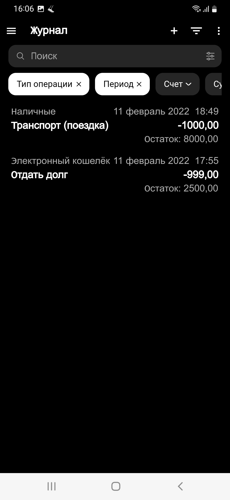

 The application is not finished. UI only. 

- [Used packages](#used-packages)
- [Images](#images)

# Used packages

- get_it;
- flutter_svg;
- hexcolor;
- flutter_bloc;
- bloc;
- blur;
- infinite_carousel;
- dotted_border;
- flutter_switch;
- intl.

# Images

  

  

  

  

  

  

